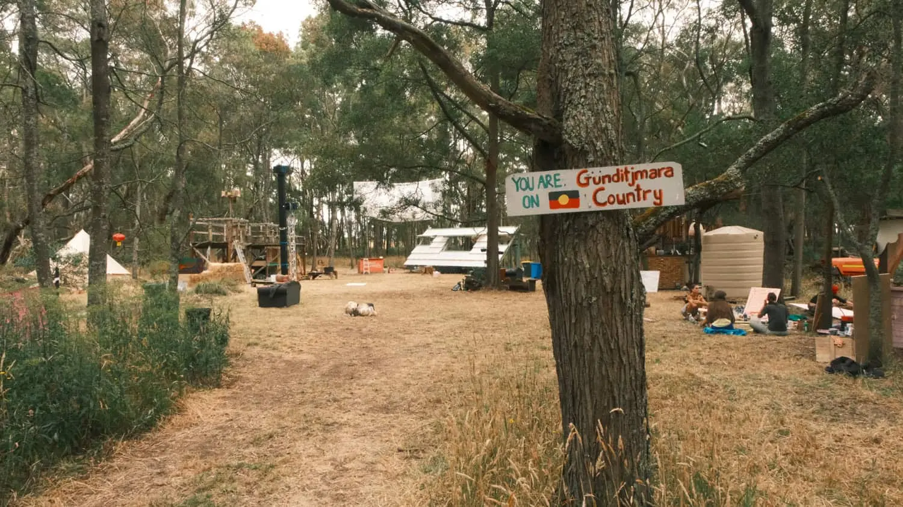
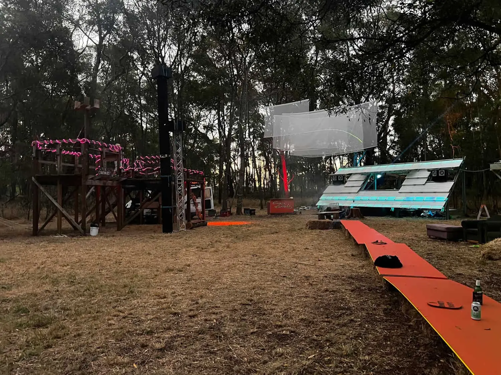
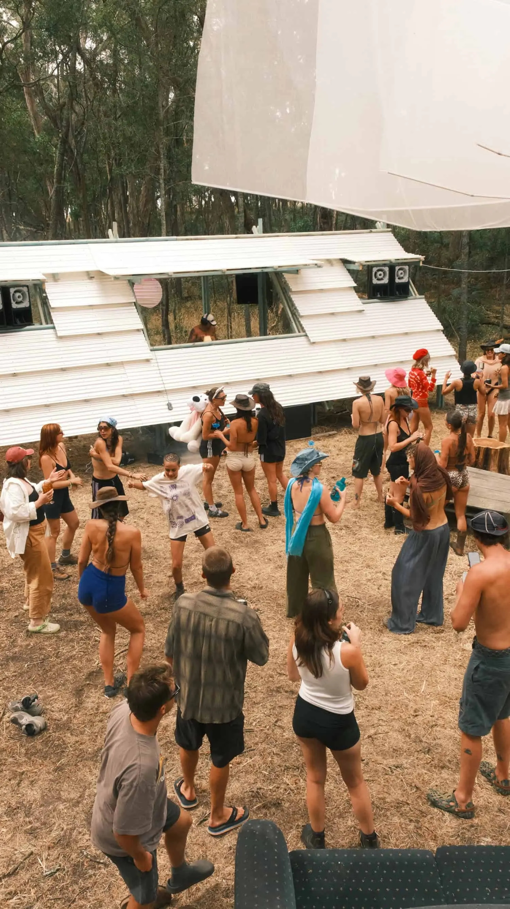
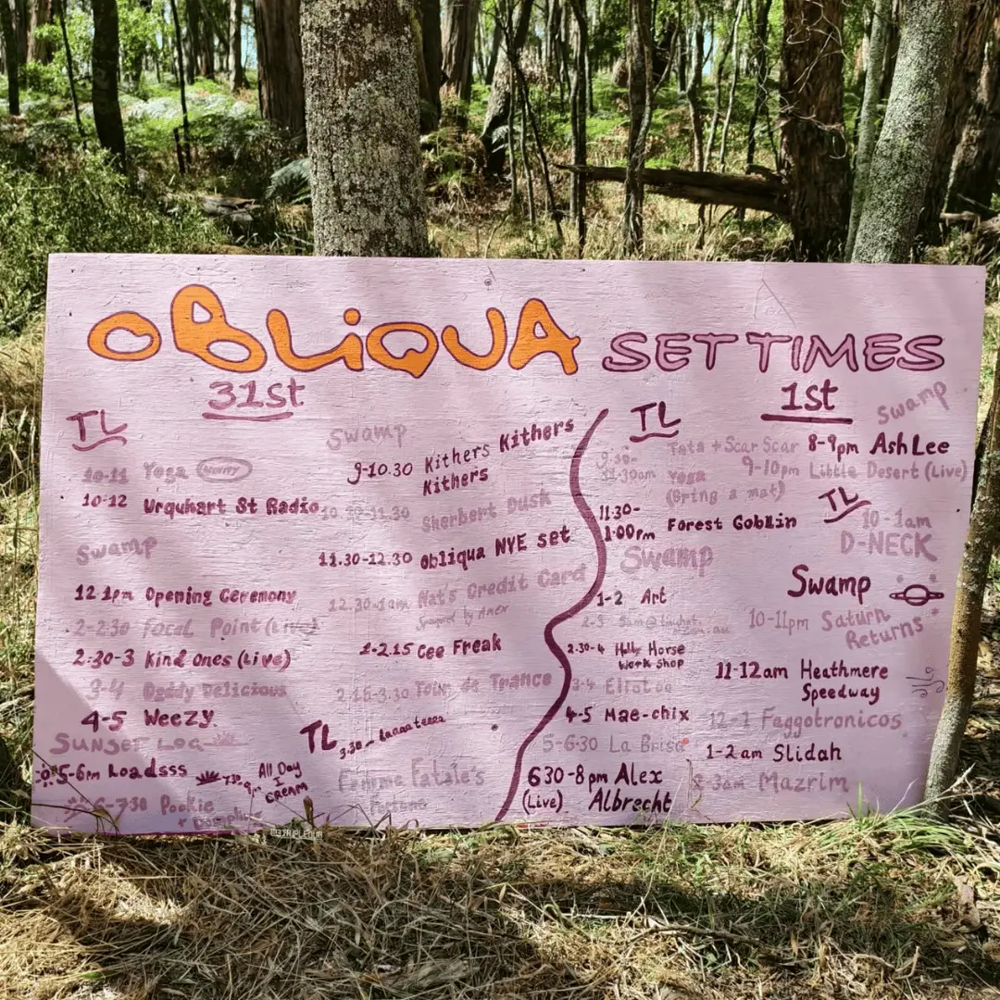
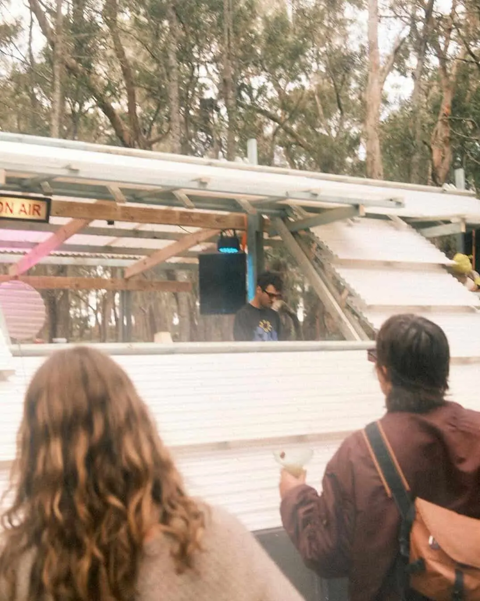
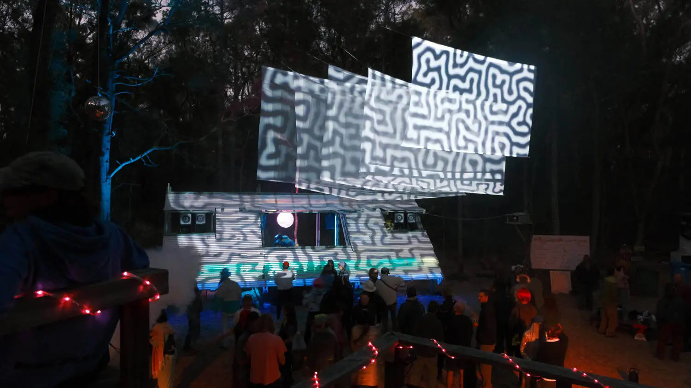
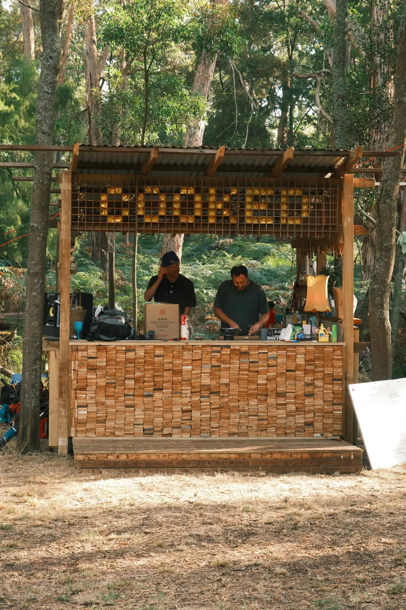
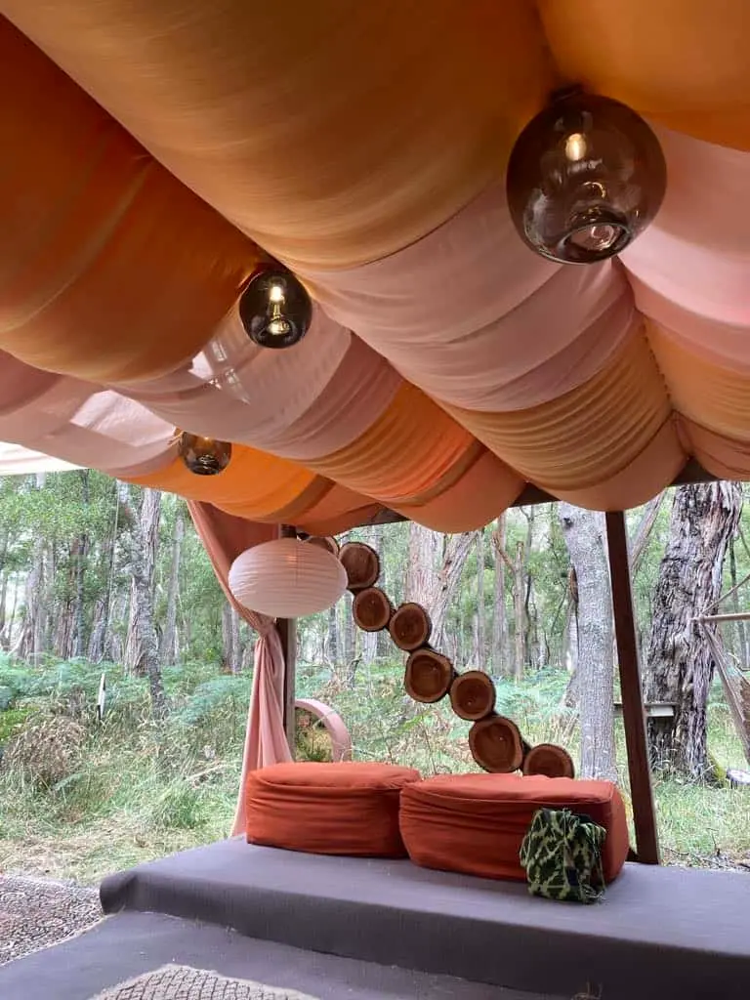
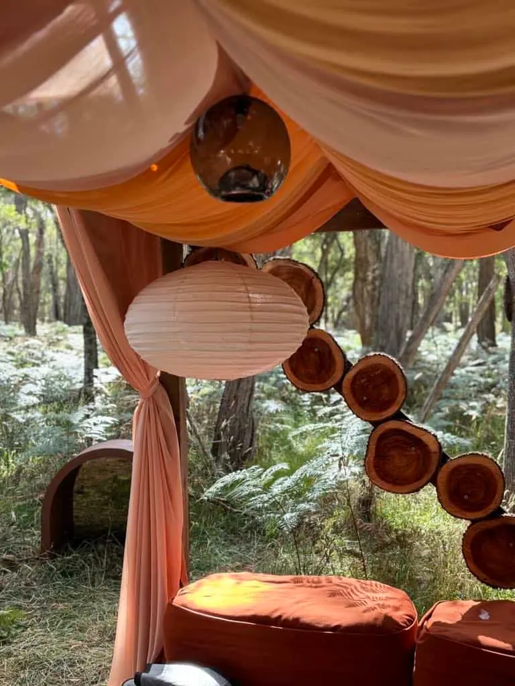
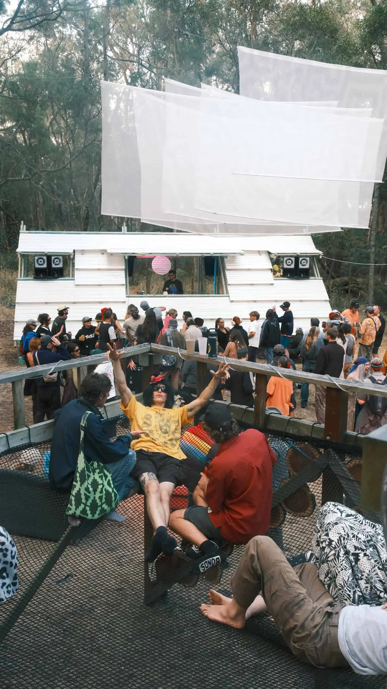

The Final Frontier

We kicked off 2025 with our first recording job of the year at **Obliqua Festival**. A small gathering in Western Victoria, close to the South Australia border.

The grassroots event was comprised of a main stage, tea lounge and sunset stage—with communal lunches, a variety of cocktails, designer wines and cold tap beer included in the ticket price. All set in the middle of untouched bush on **Gunditjmara country**.

With a stacked lineup of passionate DJ’s, a sound system with subwoofers modelled on Danley’s TH112, a curated, well executed program and a Bitchin’ Kitchen, Obliqua kicked off on **Jan 31 2024** and concluded on **2 Jan 2025**. Allowing the punters 4 full days to do what they do best..

AudioLabs’ role was to record DJ sets performed on the main stage. A bold structure that stood proud in the performance arena and transformed into a psychedelic projection medium once the sun had ducked behind the obliqua trees.

We used the **Rodecaster Pro II** for a “set-and-forget” approach, capturing entire days of recordings. This device was chosen over alternatives like the Zoom recorder for its ability to record directly through its preamps onto a **Samsung 4TB SSD**. Its overwrite and autosave functions proved invaluable, especially during power outages.

Over the four days, we captured **24 DJ sets**, which we brought back to the AudioLabs studio in Melbourne for light editing. This process involved splitting the continuous recordings into individual sets, normalising levels to **0dB**, and balancing quieter or louder sections.

Two standout sets of the festival were Alex Albrecht Live and Little Desert Live.

**Alex Albrecht Live**

A household name among the Obliqua punters, Alex delivered a driving and captivating
90-minute set, giving the sound system a solid workout. Seamless from start to finish, his signature deep house sound filled the air with floating melodies, a vast collection of atmospheric and percussive elements, and the occasional nod to the Australian landscape. The live set tied this all together with a 4/4 pulse that kept the dancers grooving under the late afternoon sun.

Alex gave Obliqua a masterclass in showcasing the gentler side of electronic music, down under.

Listen to Alex’s set via this **[link](https://www.mixcloud.com/3TripleQua/alex-albrecht-live-obliqua-2025/)**.

**Little Desert Live**

The power duo behind the festival’s twilight projection and lighting design brought an hour of organised improvisation. Their deep, trance-inducing electronic sounds blended perfectly with ethereal vocals had the audience locked in as the program moved into the night on New Years Day.

The underlying theme of the set; connection to ancestors and to country resonated across the dance floor and was perfectly situated in the bush.

Listen to Little Desert’s set via this **[link](https://www.mixcloud.com/3TripleQua/little-desert-live-obliqua-2025/)**.

*I remember getting very cold during this performance as I hadn’t changed for nighttime, but I couldn’t leave the stage!*

Other notable highlights were:

**The Food:** Incredible job by the kitchen crews to not only feed everyone, but offer heartfelt,mum’s cooking style food to the weary dancers.

**The Tea lounge:** A calming refuge decorated with soft, flowing saharan colours styled with Studio Dokola Glass — the perfect contrast to the lush greenery that surrounded the area.

**The Platform:** The bird’s nest hang out, where you were able to observe the party and suspend yourself in the netting. Skilled carpentry was evident throughout the entire arena, creating an interactive adult playground.

**The Attendees:** They say it’s the people that make the party.. it couldn’t be more true for Obliqua Festival. A collection of seasoned veterans who all had something to offer in some form or another. It was a collaborative effort on all fronts which elevated the event to new heights.

**The Organisers and Owners:** A combination of vision and location. It’s clear why these two elements have come together and work so harmoniously. Without one, there simply wouldn't be the other.

It’s been a strong start to the year 2025, and it will be interesting to what the future holds for this unique gathering. Obliqua Festival has set the bar high, and we’re honoured to have been a part of this edition.

AudioLabs (Benny)
x

Image credits
Graphics: Oliver Puttick
Photos: Josh White, Kaitlyn Weekes, Alex Albrecht